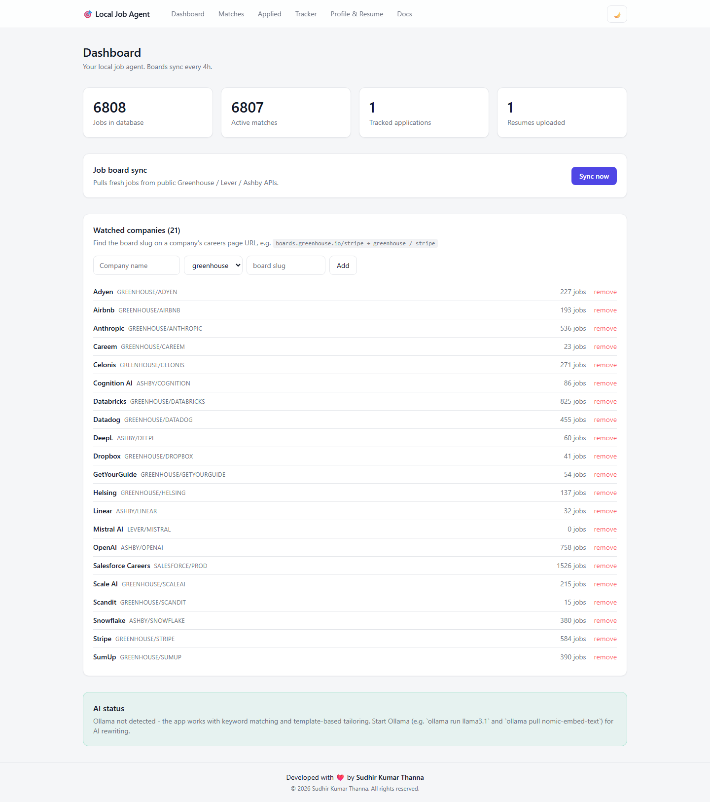
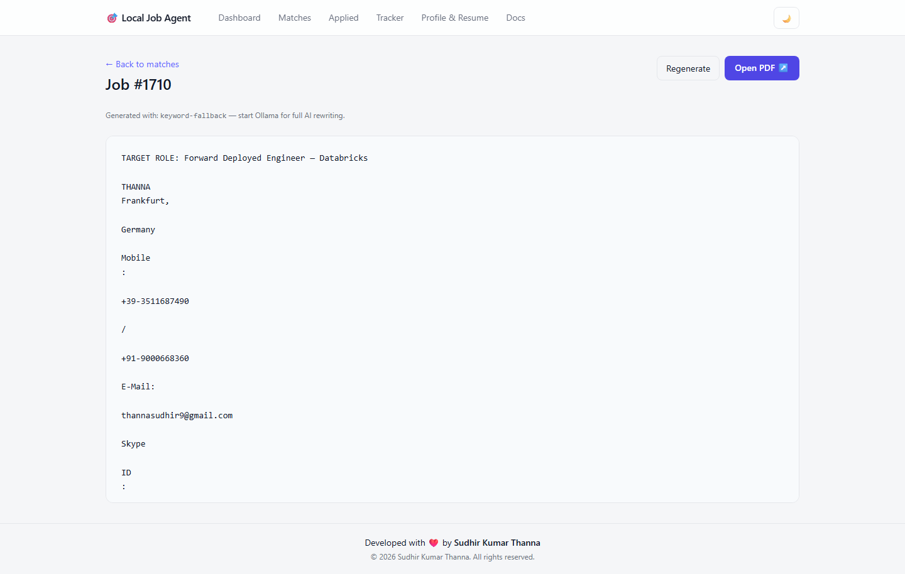
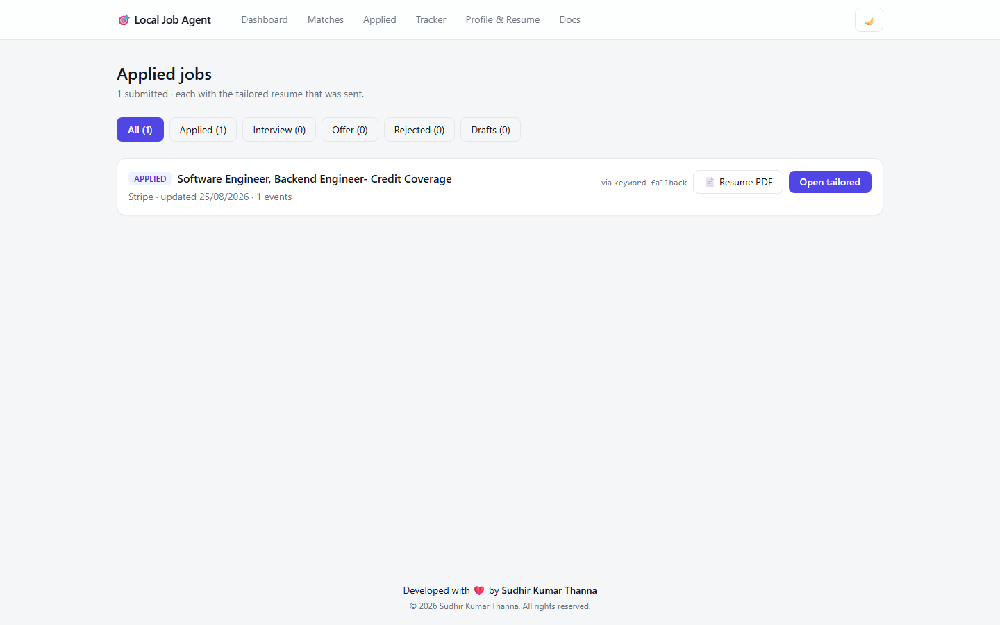
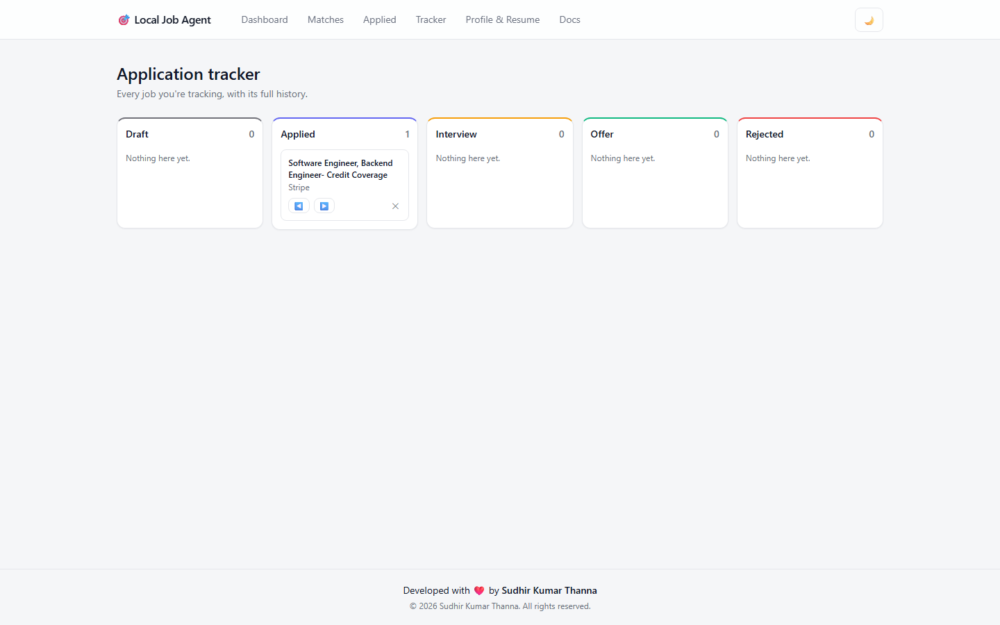
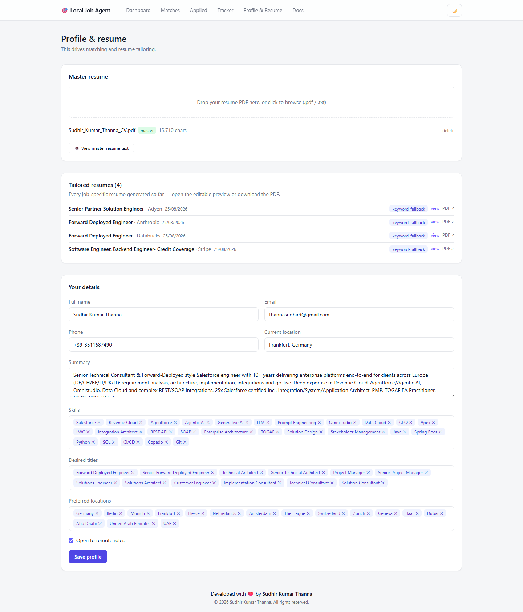
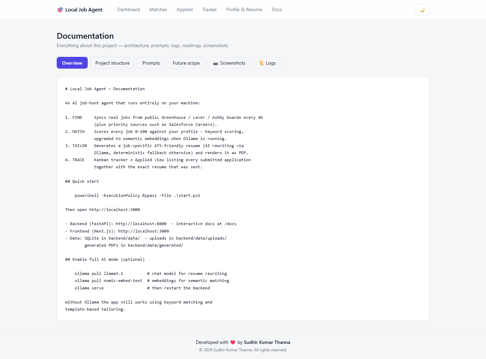
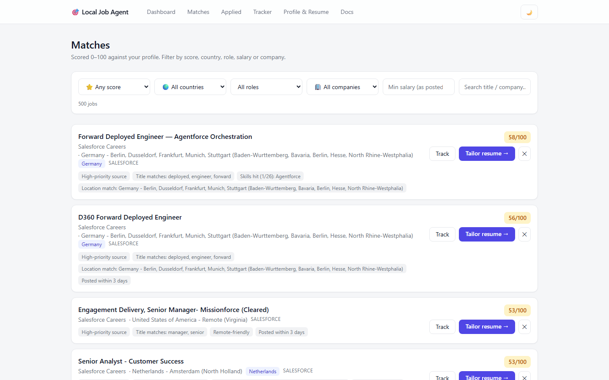

# 🎯 AI Job Search Engine

**A self-hosted AI career agent — inspired by tsenta.com — that runs 100% on your machine.**
It finds matching jobs, scores them against your profile, tailors your resume per job,
and tracks every application.

> **Last updated: 2026-08-25 22:53 CEST** · Owner: [Sudhir Kumar Thanna](https://www.linkedin.com/in/thanna-sudhir-kumar-/)
> Built for Forward Deployed Engineer / Technical Architect / Project Manager roles across 🇩🇪 Germany, 🇳🇱 Netherlands, 🇨🇭 Switzerland, 🇦🇪 Dubai/UAE.

---

## ✨ Features

| | Feature |
|---|---|
| 🔎 | **Find** — 25 job sources synced every 4h: Greenhouse / Lever / Ashby boards (OpenAI, Anthropic, Databricks, Snowflake, DeepL, Careem, Adyen…), Salesforce Careers CDN feed, LinkedIn public search |
| ⭐ | **Match** — every job scored **0–100** against your profile (keyword engine; auto-upgrades to semantic embeddings when Ollama is running), priority boost for chosen sources |
| 📄 | **Tailor** — one-click job-specific ATS-friendly resume via local LLM (Ollama) with deterministic fallback; rendered to PDF |
| 💰 | **Salary insight** — multi-currency extraction (EUR € · USD $ · CHF · AED · GBP £) from descriptions and structured feeds |
| 🗂️ | **Track** — kanban tracker + *Applied* view showing exactly which resume went to which job |
| 🌍 | **Filters** — country, role family (FDE / PM / Solutions / Architect…), minimum salary, company, minimum score |
| 🌗 | **Themes** — light (default) + dark, persisted |
| 📚 | **Docs tab** — architecture, prompts, live server logs, roadmap, screenshot gallery with magnify/scroll |

## 🖼️ Screenshots

All captures live in [`frontend/public/screenshots/`](frontend/public/screenshots/) and are also
viewable in-app under **Docs ▸ Screenshots** (click to magnify, scroll, arrow-key through).

| Dashboard | Matches |
|---|---|
|  |  |

| Tailored resume | Applied jobs |
|---|---|
|  |  |

| Tracker | Profile & resume |
|---|---|
|  |  |

| Documentation tab | Dark theme |
|---|---|
|  |  |

*Captured 2026-08-25 with Playwright (`scripts/dev/screenshot.py`).*

## 🚀 Quick start

Requirements: Python 3.12+, Node 18+.

```powershell
powershell -ExecutionPolicy Bypass -File .\start.ps1     # opens backend :8000 + frontend :3000
```

Then open **http://localhost:3000**

First run seeds Stripe/Airbnb/Dropbox boards, pulls ~7k jobs, and you're live.
Go to **Profile & Resume** → upload your CV → check **Matches**.

Manual start:

```powershell
cd backend;  .\.venv\Scripts\python.exe -m uvicorn app.main:app --port 8000   # API docs at /docs
cd frontend; npm.cmd run dev                                                    # or: npm.cmd run start
```

### Optional: full AI mode

```bash
ollama pull llama3.1 && ollama pull nomic-embed-text && ollama serve
```

Restart the backend — tailoring switches to LLM rewriting and matching gains semantic scoring automatically.

## 🏗️ Architecture & documentation

Full documentation ships **inside the app**: `http://localhost:3000/docs`
(Overview · Project structure · Prompts · Live logs · Future scope · Screenshots).

On-disk docs:

| File | Contents |
|---|---|
| [`PLAN.md`](PLAN.md) | original build plan (phases, stack decisions) |
| [`COMMANDS.md`](COMMANDS.md) | every important command used while building, chronological |
| [`scripts/dev/`](scripts/dev/) | all development/probe/test scripts used during the build |
| [`backend/app/services/llm.py`](backend/app/services/llm.py) | the exact LLM prompts used for resume tailoring |
| [`scripts/import_saved_jobs.py`](scripts/import_saved_jobs.py) | import LinkedIn saved jobs via your Chrome session |

Stack: **FastAPI + SQLAlchemy/SQLite + APScheduler + fpdf2 + httpx** (Python 3.14) ·
**Next.js 16 App Router + Tailwind v4** (TypeScript) · **Playwright** for capture/E2E · **Ollama** optional.

## 🧪 End-to-end tests

`scripts/dev/e2e_test.py` drives a real browser through every feature — **10/10 passing** as of 2026-08-25:

```powershell
backend\.venv\Scripts\python.exe scripts\dev\e2e_test.py
```

## 🔒 Privacy

Your CV, profile, database (`backend/data/`) and generated PDFs never leave your machine —
they are gitignored and stay local. The only outbound calls are to public job-board APIs
(and Ollama locally if enabled).

## 📅 Changelog

- **2026-08-25** — v1.0: full pipeline live (find → match → tailor → track), filters incl.
  score/country/role/salary/company, light/dark themes, Docs tab w/ live logs + zoomable
  screenshots, Salesforce Careers priority feed, LinkedIn public-search sources,
  multi-currency salaries, E2E suite green.

---

Developed with ❤️ by **Sudhir Kumar Thanna** · © 2026 Sudhir Kumar Thanna. All rights reserved.
